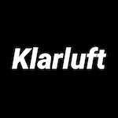

# tzKlar boilerplate (Tezos FA2 NFT)

[](https://tzklar.com)

**Tezos [tzKlar](https://tzklar.com) FA2 NFT contract boilerplate by [Klarluft](https://klarluft.com)**

Example of [FA2](https://medium.com/tqtezos/introducing-fa2-a-multi-asset-interface-for-tezos-55173d505e5f) NFT-like Tezos contract setup, compliant with [TZIP-12](https://gitlab.com/tezos/tzip/-/blob/master/proposals/tzip-12/tzip-12.md), [TZIP-16](https://gitlab.com/tezos/tzip/-/blob/master/proposals/tzip-16/tzip-16.md) and [TZIP-21](https://gitlab.com/tezos/tzip/-/blob/master/proposals/tzip-21/tzip-21.md) with on and off chain views and metadata json generation and deployment to IPFS.

[](https://youtu.be/aSBzlnIwLp4)

# How to use it

First of all. This is a template so you are encouraged to change everything however you like.

First you need to fork it or just click "Use this template" on GitHub to create your own repo based on this one.

**Docker**

You need [Docker](https://docs.docker.com/get-docker/) installed on your machine - we're using it to compile contracts with [LIGO](https://ligolang.org/) image. Also Docker is used to spin up local Tezos sandbox with [Flextesa](https://gitlab.com/tezos/flextesa).

**Pinata**

You need to create an account on [Pinata](https://www.pinata.cloud/) and obtain [API keys](https://app.pinata.cloud/keys). We're using Pinata to host our assets and metadata files on [IPFS](https://ipfs.io/).

**IPFS**

Most likely you will need [IPFS Desktop](https://docs.ipfs.io/install/ipfs-desktop/) installed to freely access files on `ipfs://` protocol.

**Environment variables**

Copy `./.env.example` file into `.env` and fill it with Pinata credentials. Example file is already set up with credentials for sandbox so initially you don't have to change anything else there. But if you would like to deploy your contracts to some other network just change rpc, signers and network name.

**Install all the packages**

```
yarn install
```

**Starting and stopping sandbox**

```
yarn tzklar start-sandbox
yarn tzklar stop-sandbox
```

**Check your tezos credentials and current network**

This is basically checking what you have currently in your `./.env` file.

```
yarn tzklar check-tezos-config
```

**Compile contract**

It will take your ReasonLIGO contract and compile it to Michelson (.tz and .json). Example FA2 contract is located in [`./src/contract/contract.religo`](./src/contract/contract.religo).

```
yarn tzklar compile-contract
```

**Compile off-chain views**

To be compliant with TZIP-12 and TZIP-16 we need Michelson code for our off-chain views. Since writing Michelson code is not an easy task we're compiling some specific functions from main religo contract. Later this compiled views will be used to populate contract metadata JSON.

```
yarn tzklar compile-off-chain-views
```

**Generate contract metadata**

```
yarn tzklar generate-contract-metadata
```

**Pin contract metadata JSON to IPFS**

```
yarn tzklar pin-contract-metadata
```

**Pin our NFT image to IPFS**

```
yarn tzklar pin-token-0-asset
```

**Generate token metadata**

This repo shows an example token of id "0".

```
yarn tzklar generate-token-0-metadata
```

**Pin token metadata JSON to IPFS**

```
yarn tzklar pin-token-0-metadata
```

**Finally, originate contract on Tezos**

```
yarn tzklar originate-contract
```

**Mint token**

Here's an example script that will mint token 0 for a given account. This example contract allows you to mint the same token many times but feel free to change the contract however you like.

```
yarn tzklar mint 0 tz1VSUr8wwNhLAzempoch5d6hLRiTh8Cjcjb
```

**Run tests**

You can write and check tests of your contract

```
yarn test
```

## References

Resources that were very helpful in creating this repository:

- https://github.com/oxheadalpha/nft-tutorial
- https://github.com/oxheadalpha/smart-contracts

## About

[](https://klarluft.com)
[](https://github.com/michal-wrzosek)

[tzKlar](https://tzklar.com) project is created and maintained by [Michal Wrzosek](https://github.com/michal-wrzosek) from [Klarluft](https://klarluft.com).
